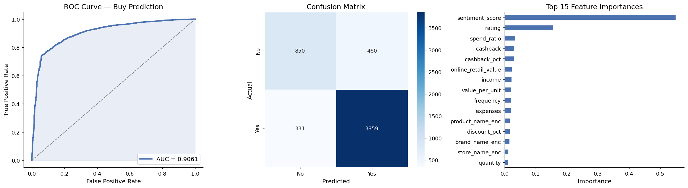
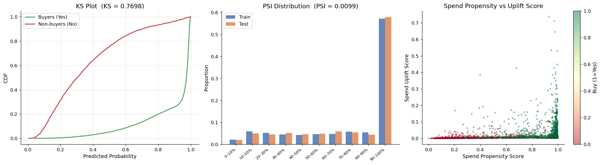
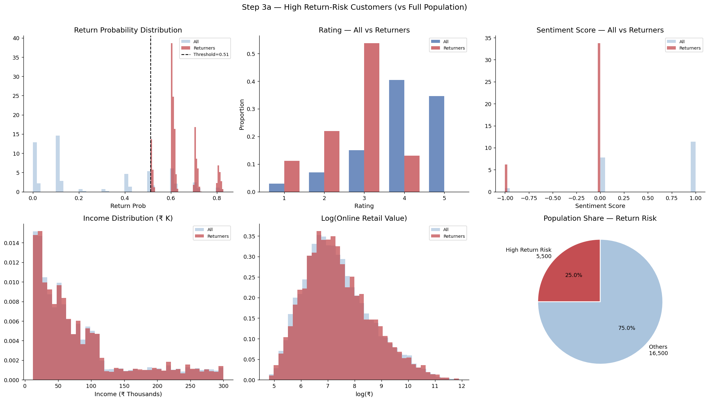
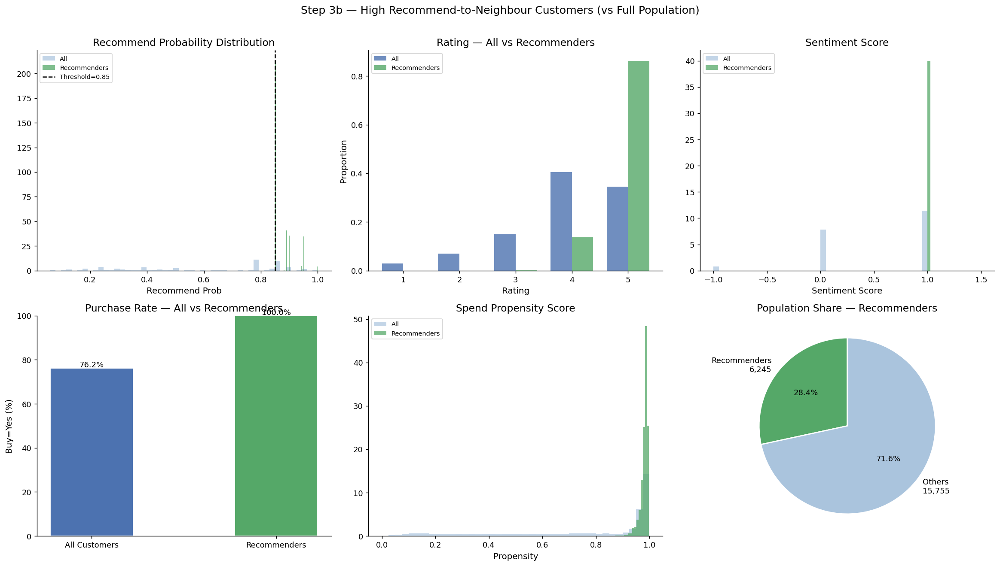
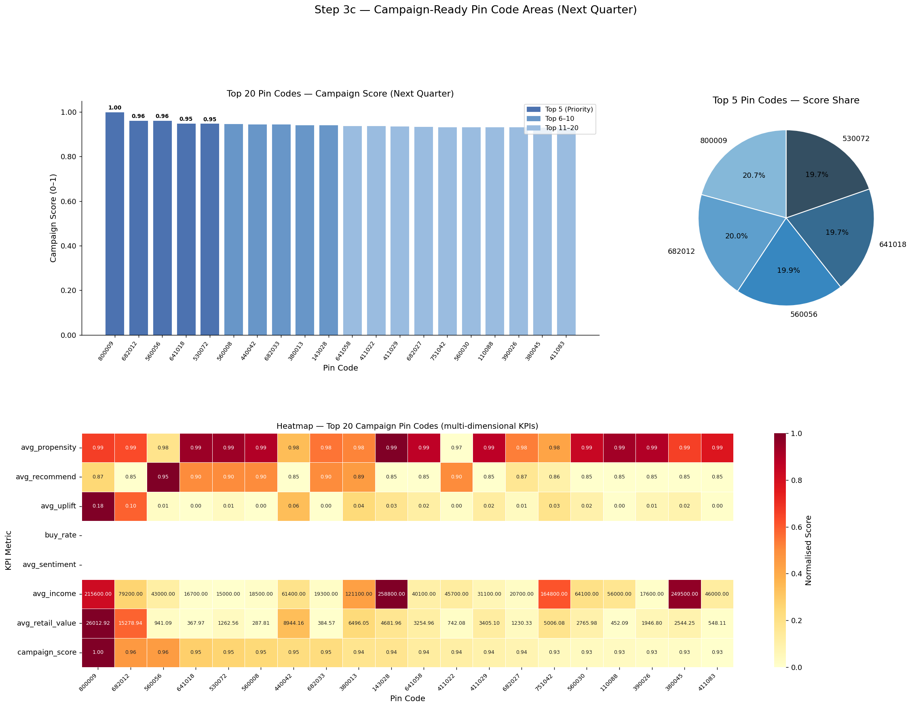
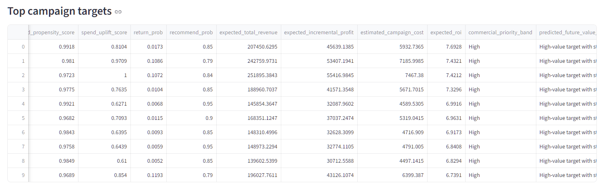
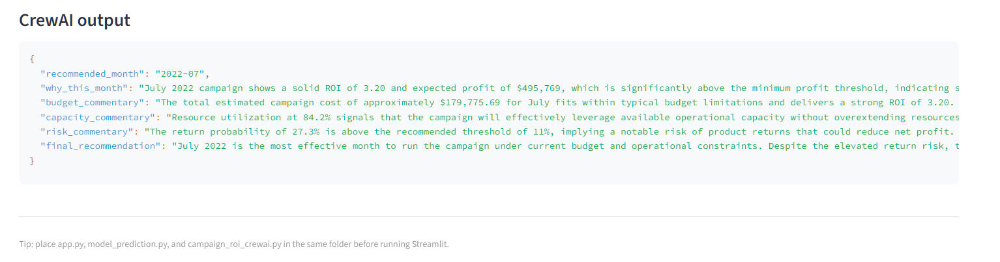
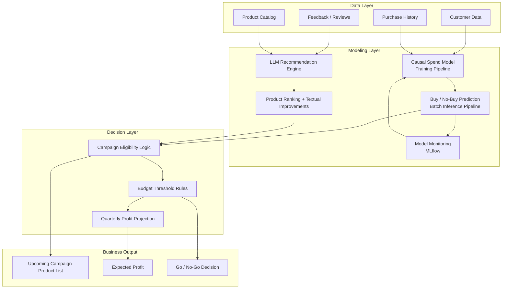

# 🚀 Campaign Intelligence Platform

AI-driven campaign optimization system combining **LightGBM predictions, causal modeling, and LLM-powered recommendations (CrewAI)** with an interactive **Streamlit UI** for ROI-based customer targeting and marketing decisioning.

---

# 🔬 Research Statement

This project was developed to explore how hybrid AI systems can improve enterprise-scale marketing intelligence by combining:

- classical machine learning,
- ranking systems,
- causal reasoning,
- recommendation intelligence,
- and agentic AI workflows.

The primary research objective is to move beyond traditional recommendation systems and build a business-aware decision intelligence platform capable of optimizing long-term customer engagement and campaign profitability.

---

## 📌 Research Objectives

### 1. Repeat Purchase Probability Modeling

The first objective is to estimate:

> If a customer purchases a product once, what is the probability that the same customer will purchase the product again multiple times in the future?

This includes:
- repeat purchase prediction,
- customer loyalty estimation,
- and future buying behavior analysis.

For this task, classical machine learning models are used to learn customer purchasing patterns and behavioral tendencies.

---

### 2. Dynamic Product Popularity & Ranking Intelligence

The second objective is to understand how product popularity evolves over time after purchases occur within the product inventory ecosystem.

This includes:
- dynamic popularity scoring,
- product ranking optimization,
- and recommendation prioritization.

For this task, ranking models such as:
- LambdaMART,
- LightGBM ranking,
- and learning-to-rank techniques

are explored to continuously adjust product ranking based on customer interactions and purchasing behavior.

---

### 3. Customer Referral & Neighborhood Influence Prediction

The third objective is to analyze:

> If a customer becomes highly loyal to a product, what is the probability that the customer may recommend the same product to nearby customers within the same neighborhood or pincode region?

This introduces:
- localized recommendation propagation,
- neighborhood influence modeling,
- referral probability estimation,
- and geo-aware recommendation intelligence.

The goal is to simulate real-world customer influence patterns in localized marketing ecosystems.

---

### 4. ROI-Driven Campaign Intelligence Using Agentic AI

The final objective is to identify:

> Which upcoming marketing campaigns are expected to become the most profitable after analyzing all targeted customers collectively?

This includes:
- campaign profitability forecasting,
- budget-aware optimization,
- autonomous decision support,
- and intelligent campaign planning.

For this layer, an Agentic AI framework is used to orchestrate:
- recommendation reasoning,
- campaign evaluation,
- profitability analysis,
- and final business decision generation.

The long-term vision is to evolve the system into a fully intelligent campaign decisioning platform capable of supporting enterprise marketing operations.

## 🔥 Key Features

- 📊 ROI-driven campaign optimization (not just prediction)
- 🤖 LightGBM-based customer behavior modeling
- 🎯 Causal modeling for uplift & spend estimation
- 🧠 LLM-powered recommendation engine
- 🤝 Agentic decision system (CrewAI)
- 📈 End-to-end pipeline from data → decision → business output
- ⚙️ Production-oriented with MLflow monitoring

Built end-to-end using Python, LightGBM, CrewAI, MLflow, and Streamlit.

---

## 🌐 Live Demo

https://campaignapp-k2b8xhwmmbhozjntrbmuvw.streamlit.app/

## 💻 GitHub Repository

https://github.com/reetayan/campaign_app/tree/main

# 🎯 Vision

Traditional recommendation systems focus only on prediction accuracy.

This platform goes beyond prediction by combining:

- customer intent modeling,
- causal uplift analysis,
- LLM-driven recommendation intelligence,
- and ROI-aware campaign planning

to help businesses make profitable marketing decisions.

# 💼 Business Value

The platform helps organizations:

✅ Identify high-value customers  
✅ Predict future buying intent  
✅ Optimize campaign budget allocation  
✅ Improve recommendation quality  
✅ Increase marketing ROI  
✅ Support Go / No-Go campaign decisions  
✅ Generate explainable AI-driven targeting strategies

# 🔄 End-to-End Workflow

1. Upload customer behavior dataset
2. Run customer prediction pipeline
3. Generate propensity/uplift scores
4. Apply causal intelligence layer
5. Generate LLM-based recommendations
6. Apply campaign eligibility logic
7. Evaluate budget thresholds
8. Produce ROI-aware campaign outputs

# ⚙️ Tech Stack

| Layer | Technologies |
|---|---|
| ML Modeling | LightGBM, Scikit-learn |
| Causal AI | Causal Modeling |
| LLM Layer | CrewAI |
| Monitoring | MLflow |
| UI | Streamlit |
| Data Processing | Pandas, NumPy |
| Deployment | Streamlit Community Cloud |

# 📈 Example Outputs

The platform generates:

- Buy probability
- Spend uplift score
- Sentiment score
- ROI projections
- Product recommendations
- Campaign eligibility
- Budget-aware targeting outputs

# 📂 Project Structure

```text
CAMPAIGN/
│
├── .streamlit/
│   └── secrets.toml
│
├── .venv/
│
├── data/
│   ├── customer_behavior_with_reviews_scores.csv
│   └── customer_behavior_with_reviews.csv
│
├── images/
│
├── notebooks/
│
├── outputs/
│   ├── campaign_ready_pincodes.csv
│   ├── crew_agent_output.txt
│   ├── crew_inputs.json
│   ├── customer_behavior_with_predictions.csv
│   ├── optimized_campaign_plan.csv
│   ├── roi_driven_customer_opportunities.csv
│   ├── roi_driven_monthly_summary.csv
│   └── top_campaign_targets.csv
│
├── src/
│   ├── __pycache__/
│   ├── campaign_roi_crewai.py
│   └── model_prediction.py
│
├── .env
├── .gitignore
├── agentic_production.md
├── app.py
├── README.md
├── requirements.txt
└── runtime.txt
```

# 🖥️ Product UI

## Model Prediction Interface

### model health



### buyer vs non buyer 




### dashboard tells about the predicted buying behavior of the targeted customers and area




### Average recommendation for the targeted customers in terms of each campaign cost estimation


### Top_targeted campaign and it's expected ROI



### final crew output summary



---

## Campaign ROI Planner


## 🧠 System Architecture Overview

This system is designed as a **multi-layered intelligent pipeline** that transforms raw customer data into actionable marketing decisions.

---


## 📊 Architecture Diagram



# ⭐ Support

If you found this project useful, consider starring the repository.